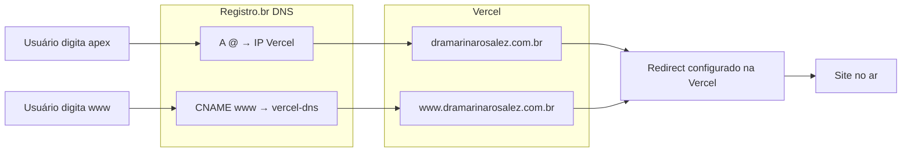

# Configurar zona DNS para redirecionamento — Dra. Marina

Guia para configurar o domínio `dramarinarosalez.com.br` no Registro.br e redirecionar corretamente para o site na Vercel (com ou sem `www`).

---

## Visão geral

| Etapa | Onde | O que fazer |
|-------|------|-------------|
| 1 | Vercel | Adicionar domínio apex e www; definir redirecionamento |
| 2 | Registro.br | Configurar zona DNS com os registros indicados pela Vercel |
| 3 | Aguardar | Propagação DNS (minutos a 24h) |

---

## Passo 1 — Configurar domínios na Vercel

1. Acesse [vercel.com/dashboard](https://vercel.com/dashboard)
2. Selecione o projeto **dra-marina-rosalez**
3. Vá em **Settings** → **Domains**
4. Clique em **Add** e adicione:
   - `dramarinarosalez.com.br` (apex)
   - `www.dramarinarosalez.com.br` (www)

5. A Vercel vai sugerir adicionar o `www` automaticamente ao adicionar o apex — aceite.

6. **Definir redirecionamento:**
   - Na lista de domínios, clique nos **três pontinhos** ao lado do domínio que deve redirecionar
   - Selecione **Edit** → **Redirect to**
   - Escolha o domínio de destino:
     - **Opção A:** `www.dramarinarosalez.com.br` como principal → redirecionar `dramarinarosalez.com.br` para `www`
     - **Opção B:** `dramarinarosalez.com.br` como principal → redirecionar `www` para o apex

7. A Vercel exibirá os **registros DNS** necessários. Anote ou deixe a tela aberta para o próximo passo.

---

## Passo 2 — Configurar zona DNS no Registro.br

### 2.1 Acessar a zona DNS

1. Acesse [registro.br](https://registro.br) e faça login
2. Em **Meus domínios**, clique em **dramarinarosalez.com.br**
3. Se estiver em **Modo Básico**, mude para **Modo Avançado**:
   - Clique em **Configurar Endereçamento**
   - Selecione **Modo Avançado**
   - Confirme
4. Clique em **Configurar zona DNS**

### 2.2 Adicionar os registros indicados pela Vercel

Os valores exatos aparecem no painel da Vercel (Settings → Domains). Use sempre o que a Vercel mostrar. Exemplo atual:

| Tipo | Nome/Host | Valor/Destino | TTL |
|------|-----------|---------------|-----|
| **A** | `@` (ou vazio) | `216.198.79.1` | 3600 |
| **CNAME** | `www` | `6e77262b48e0b5d1.vercel-dns-017.com` | 3600 |

**Importante:** A Vercel expandiu a faixa de IPs. O IP do registro A pode ser `216.198.79.1` (novo) ou `76.76.21.21` (antigo). O CNAME é específico do projeto (ex: `6e77262b48e0b5d1.vercel-dns-017.com`). Use sempre os valores exibidos no painel da Vercel.

### 2.3 Como adicionar cada registro

1. Clique em **NOVA ENTRADA**
2. Para o **registro A (apex):**
   - Tipo: **A**
   - Nome: `@` ou deixe em branco (representa o domínio raiz)
   - Destino: o IP mostrado na Vercel (ex: `216.198.79.1`)
   - TTL: `3600` (ou o padrão do Registro.br)
3. Clique em **Adicionar**
4. Para o **registro CNAME (www):**
   - Tipo: **CNAME**
   - Nome: `www`
   - Destino: o valor mostrado na Vercel (ex: `6e77262b48e0b5d1.vercel-dns-017.com`)
   - TTL: `3600`
5. Clique em **Adicionar**

### 2.4 Remover registros conflitantes

Se já existirem registros **A** ou **CNAME** para `@` ou `www` que apontem para outro destino, remova-os antes de adicionar os novos. No Registro.br, use a opção de editar/excluir ao lado de cada entrada.

---

## Passo 3 — Verificar propagação

1. Aguarde alguns minutos (propagação pode levar até 24h)
2. No painel da Vercel, o status do domínio deve mudar para **Valid Configuration**
3. Teste no navegador:
   - `https://dramarinarosalez.com.br`
   - `https://www.dramarinarosalez.com.br`
4. Ambos devem abrir o site e redirecionar para o domínio principal definido na etapa 1.

---

## Resumo do fluxo

---

## Problemas comuns

| Problema | Solução |
|----------|---------|
| Domínio não resolve | Aguardar propagação; verificar se os registros foram salvos corretamente |
| Erro de SSL/HTTPS | A Vercel emite certificado automaticamente; pode levar alguns minutos após o DNS propagar |
| www e apex não redirecionam | Conferir em Vercel → Domains se o redirect está configurado |
| Registro.br em Modo Básico | É preciso mudar para Modo Avançado para editar zona DNS |

---

## Referências

- [Vercel — Deploying & Redirecting Domains](https://vercel.com/docs/domains/working-with-domains/deploying-and-redirecting)
- [Registro.br — Ajuda](https://registro.br/tecnologia/ajuda/)
